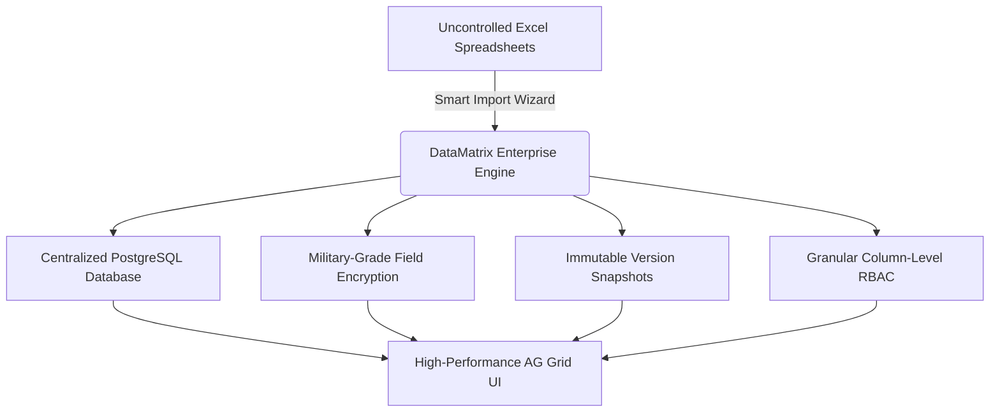

# DataMatrix Enterprise Platform
## Comprehensive Solution Overview & Client Presentation Guide

---

## 1. Executive Summary

Organizations run on data, but across departments, critical operations frequently depend on **disparate, uncontrolled Excel spreadsheets**. 

While spreadsheets are familiar, using them as enterprise data stores introduces severe organizational liabilities:
- **Version Sprawl**: Multiple conflicting copies (`v1`, `v2_final`, `v2_final_FINAL.xlsx`) circulating via email and shared drives.
- **Data Corruption & Accidental Loss**: Untracked row deletions, overwrites, or broken formulas with zero recovery options.
- **Zero Governance & Security Risks**: Plaintext storage of sensitive credentials, payroll data, or customer PII with no audit visibility.
- **Lack of Granular Access**: Inability to hide or restrict specific columns based on team roles.

### The Solution: DataMatrix Enterprise Platform
**DataMatrix** bridges the gap between spreadsheet flexibility and relational database rigor. It transforms static Excel files into **centralized, auditable, and dynamically structured web databases** without requiring custom code.

Teams maintain the high-speed agility of a spreadsheet through a high-performance **AG Grid interface**, backed by **enterprise encryption (AES-256-GCM)**, **point-in-time version rollback**, and **role-based access control (RBAC)**.



---

## 2. Business Impact: Spreadsheets vs. DataMatrix

| Capability | Legacy Excel Spreadsheets | DataMatrix Enterprise Platform |
|---|---|---|
| **Centralization** | Fragmented files scattered across desktops & drives | Single secure, self-hosted web database |
| **Concurrency** | File locking, sync conflicts, and overwritten saves | Real-time multi-user editing with ACID transaction safety |
| **Schema Governance** | Fragile; anyone can break types, formulas, or headers | 17 structured data types with enforceable validation |
| **History & Rollback** | None; once saved or closed, previous states are lost | Complete point-in-time version history with 1-click restore |
| **Field-Level Security** | Passwords and secrets stored in plaintext | Authenticated AES-256-GCM encryption with masked UI |
| **Access Control** | All-or-nothing file access | 6 built-in roles, 22 permissions, and column-level restrictions |
| **Audit Compliance** | Zero tracking of who viewed, edited, or exported data | Tamper-resistant audit trails with IP and timestamp logs |
| **Merged Cell Handling**| Merged cells break database queries and tabular imports | Automatic unmerging and smart forward-fill across all rows |

---

## 3. Core Capabilities & Feature Highlights

### ⚡ 1. Dynamic Table Architecture (No Hardcoded Schemas)
- Create unlimited custom tables on the fly without database migrations or engineering support.
- Supports **17 specialized column types**:
  - **Text & Notes**: `TEXT`, `LONG_TEXT`
  - **Numeric**: `NUMBER`, `DECIMAL`, `CURRENCY` (with locale formatting)
  - **Coded & Alphanumeric**: `MIXED` (handles identifiers like `N@R`, `DFJR`, `69012-`)
  - **Date & Time**: `DATE`, `DATETIME`
  - **Network & Web**: `IP_ADDRESS`, `URL`, `EMAIL`, `PHONE`
  - **Choice & Categorization**: `BOOLEAN`, `DROPDOWN`, `MULTI_SELECT`
  - **Files & Assets**: `FILE` (secure document attachments)
  - **Vault Secrets**: `PASSWORD` (AES-256-GCM encrypted)

---

### 📥 2. Intelligent Excel (.xlsx) Import Engine
- **4-Step Guided Wizard**:
  1. **Upload**: Drag-and-drop or browse Excel spreadsheets (`.xlsx`, `.xlsm`).
  2. **Multi-Sheet Detection**: Choose specific worksheets or batch-import all sheets into separate tables simultaneously.
  3. **Auto-Type Inference**: AI-assisted heuristics scan row samples to suggest the best data types (Currency, Date, Mixed, IP, etc.).
  4. **Pre-Import Validation**: Row-by-row breakdown displaying Valid, Warning, and Error counts before touching the database.
- **Smart Merged-Cell Forward Filling**: Automatically detects vertically merged cells (e.g. departmental categories spanning multiple rows) and unmerges them with full forward-filled values across all records.
- **Flexible Import Modes**:
  - `Create New Table`: Instantly provisions schema and data.
  - `Append`: Adds records to an existing table.
  - `Update`: Updates existing records matching a unique key column.
  - `Upsert`: Updates matches and inserts new entries.

---

### 🖥️ 3. Enterprise AG Grid Workplace
- **High-Density Data Grid**: Built on AG Grid Enterprise for buttery-smooth scrolling across tens of thousands of rows.
- **Dynamic Density Controls**:
  - **Compact (28px)**: Maximum information density for power users.
  - **Standard (34px)**: Optimal desktop balance.
  - **Comfortable (42px)**: Generous touch and presentation spacing.
- **Interactive Tools**:
  - Instant client/server quick-search and floating multi-column filters.
  - Cell double-click inline editing with **Undo / Redo stack** (`Ctrl+Z` / `Ctrl+Y`).
  - Monospace footer status bar displaying total records, editable columns, and selection tallies.
  - Action rail: Row duplication, quick edit drawers, history inspection, and full-screen focus mode.

---

### 🕒 4. Point-in-Time Revision History & 1-Click Rollback
- Every single insert, update, or cell edit generates an immutable snapshot (`RecordVersion`).
- **Visual Field Diffs**: Highlights exactly which columns were modified, showing previous values vs. new values side-by-side.
- **Instant Restore**: Accidental edits or unwanted changes can be reverted to any historical state with a single click.

---

### 🛡️ 5. Military-Grade Field Encryption & Secrets Vault
- Sensitive data (credentials, API tokens, passwords, PINs) is encrypted at rest using **authenticated AES-256-GCM** with HKDF key derivation.
- In the UI, secret values are masked by default (`••••••••`).
- Authorized users can reveal secrets on demand:
  - **Auto-Hide Security Timer**: Plaintext automatically re-masks after 30 seconds.
  - **Access Accountability**: Every secret view triggers a dedicated `PASSWORD_VIEWED` event in the audit log.

---

### 👥 6. Granular Role-Based Access Control (RBAC)
- **Built-in Enterprise Roles**:
  1. `Super Admin`: Complete platform and security oversight.
  2. `Data Admin`: Table management, user provisioning, and role assignments.
  3. `Table Manager`: Schema modifications and table-level permissions.
  4. `Data Editor`: Daily record creation, inline editing, and imports.
  5. `Data Viewer`: Read-only reporting and dashboard analytics.
  6. `Auditor`: Read-only access to system events, security logs, and version trails.
- **Column-Level Permissions**: Restrict visibility per column:
  - `VIEW_EDIT`: Full visibility and editing rights.
  - `VIEW`: Read-only visibility.
  - `DENIED`: Completely stripped from API responses and hidden in the grid.

---

### 🗑️ 7. Two-Tier Recycle Bin & Safe Soft Delete
- Eliminates catastrophic data loss.
- When tables or records are deleted, they move to the **Recycle Bin**.
- Items can be inspected, filtered, and restored with 100% data fidelity.
- Permanent deletion requires deliberate secondary confirmation by authorized administrators.

---

### 📊 8. Live Real-Time Dashboard & Zero Fake Data Guarantee
- Database metrics (Active Tables, Total Records, Changes Today, Imports Today) are computed dynamically from live PostgreSQL tables.
- Activity feeds track genuine operations — no mock statistics, no dummy placeholders.

---

## 4. Technical Architecture & Technology Stack

```
┌────────────────────────────────────────────────────────┐
│               Client Web Browsers                      │
└───────────────────────────┬────────────────────────────┘
                            │ HTTPS (Port 80 / 443)
┌───────────────────────────▼────────────────────────────┐
│              Nginx Edge Reverse Proxy                  │
└─────────────┬────────────────────────────┬─────────────┘
              │ /                          │ /api/v1/*
┌─────────────▼────────────┐ ┌─────────────▼────────────┐
│   Frontend React 19 SPA  │ │    Backend FastAPI Service│
│  - TypeScript 5.8 / Vite │ │  - Python 3.12 / Pydantic │
│  - AG Grid Enterprise    │ │  - Async SQLAlchemy 2.0   │
│  - Material UI (MUI v6)  │ │  - OpenPyXL / Argon2id    │
└──────────────────────────┘ └─────────────┬────────────┘
                                           │
                             ┌─────────────▼────────────┐
                             │   PostgreSQL 16 Engine   │
                             │  - Dynamic Schemas       │
                             │  - AES-256 Encrypted     │
                             │  - Immutable Audit Logs  │
                             └──────────────────────────┘
```

- **Backend**: Python 3.12, FastAPI (high-concurrency ASGI), SQLAlchemy 2.0 Async, Pydantic v2.
- **Frontend**: React 19, TypeScript 5.8, Vite, Material UI (MUI v6), AG Grid Enterprise.
- **Security**: Argon2id password hashing, AES-256-GCM field encryption, HKDF key derivation.
- **Storage**: Docker Named Volumes (`postgres_data`, `backend_attachments`) ensuring zero data loss during upgrades.

---

## 5. Client Presentation / Live Demonstration Script

When demonstrating DataMatrix to prospective clients or stakeholders, follow this recommended **5-Stage Demo Flow**:

### Stage 1: The Problem & Dashboard Introduction (2 mins)
1. Open the **Dashboard** at `http://localhost:5173`.
2. Point out the live operational counters and the recent activity feed.
3. State the core message: *"Instead of managing dozens of unlinked spreadsheets, DataMatrix gives your organization a single governed platform."*

### Stage 2: The Excel Import Magic (4 mins)
1. Navigate to **Import / Excel Import Wizard**.
2. Drag and drop a sample spreadsheet with merged cells (e.g. department categories).
3. Show **Step 2 (Column Types)**: Point out how DataMatrix automatically detected column types and unmerged rows.
4. Show **Step 3 (Validation)**: Highlight the row breakdown (Valid vs. Error counts).
5. Click **Execute Import** to create the new dynamic table in seconds.

### Stage 3: The Enterprise Grid Experience (3 mins)
1. Open the newly imported table.
2. Demonstrate **inline cell editing**: Change a value and press `Ctrl+Z` to undo and `Ctrl+Y` to redo.
3. Toggle **Density** between Compact (28px) and Standard (34px) to show how much data fits on screen.
4. Use the **Quick Search** and floating column filters to filter records instantly.

### Stage 4: Version Control & Military-Grade Vault (3 mins)
1. Click on a record's history icon to open the **Point-in-Time Revision Modal**.
2. Show the visual field diff highlighting the before-and-after values.
3. Demonstrate a secret column: Show the masked `••••••••`, click **Reveal**, point out the 30-second security countdown timer, and explain that the reveal was logged in the audit trail.

### Stage 5: Security & Audit Trail (2 mins)
1. Navigate to **Audit Logs**.
2. Show the real-time record of the import, the cell edit, and the secret reveal with timestamps, user identities, and IP addresses.
3. Conclude: *"You now have the agility of Excel with the security, auditability, and compliance of an enterprise relational database."*

---

## 6. Summary & Client Takeaways

1. **Eliminate Operational Risk**: No more lost records, broken formulas, or unversioned files.
2. **Empower Business Users**: Non-technical team members can import, organize, and manage complex data without engineering tickets.
3. **Enterprise Compliance Ready**: Built-in cryptographic security, point-in-time rollback, and full audit logs align directly with GDPR, SOC 2, and internal IT governance.
4. **Self-Hosted Data Ownership**: Full on-premise or private cloud deployment in Docker ensures proprietary data never leaves client infrastructure.
