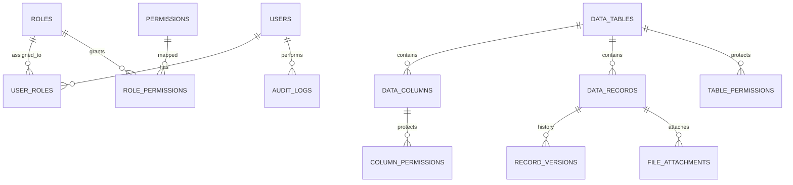

# DataMatrix - Database Architecture & Schema Design

DataMatrix utilizes PostgreSQL with an enterprise **Dynamic Table Architecture**, completely eliminating rigid, hardcoded tables (such as Employees, Assets, Servers) in favor of user-defined dynamic schema metadata coupled with JSONB dynamic records.

---

## 1. Architectural Strategy: Dynamic Schemas + JSONB Records

Traditional applications create static SQL tables with hardcoded columns. This fails in spreadsheet-replacement environments where every imported spreadsheet has arbitrary column structures.

DataMatrix solves this through a **Hybrid Relational-JSONB Design**:
1. **`data_tables`**: Defines the dynamic entity, identifier slug, description, favorite flag, and ownership.
2. **`data_columns`**: Stores column metadata (data type, display name, required status, AES-256 encryption flag, validation rules, display order).
3. **`data_records`**: Stores individual row records, holding dynamic cell data in a PostgreSQL `JSON` / `JSONB` column keyed by column name, with an integer `version` counter.
4. **`record_versions`**: Stores historical revision snapshots and field-level delta diffs whenever a record is created, modified, or restored.

### Key Advantages:
- **Zero DDL Locking**: Adding, deleting, or reordering columns does not require database `ALTER TABLE` locks on production tables.
- **Unlimited Column Flexibility**: Supports tables with 5, 20, 50, or 100+ arbitrary columns with completely different data types.
- **ACID Transactional Guarantees**: Imports, bulk updates, and rollback operations execute within standard atomic database transactions.
- **Field-Level Encryption**: Sensitive / Password values are stored inside authenticated AES-256-GCM encrypted envelopes within the JSON structure.

---

## 2. Core Relational Models

### Table Definitions

| Model | Table Name | Purpose |
|---|---|---|
| `User` | `users` | Authenticated users with Argon2id passwords and lockout counters. |
| `UserSession` | `user_sessions` | Active JWT/Bearer tokens and client IP tracking. |
| `Role` | `roles` | System and custom roles. |
| `Permission` | `permissions` | 22 granular capability flags. |
| `TablePermission` | `table_permissions` | Role-level access to dynamic tables. |
| `ColumnPermission` | `column_permissions` | Role-level access to individual columns (`DENIED`, `VIEW`, `VIEW_EDIT`). |
| `RecordLevelRule` | `record_level_rules` | Row-level filtering rules per role. |
| `DataTable` | `data_tables` | Dynamic table definition. |
| `DataColumn` | `data_columns` | Dynamic column definition (17 supported column types). |
| `DataRecord` | `data_records` | Dynamic table rows with JSON data payload and version. |
| `RecordVersion` | `record_versions` | Immutable point-in-time snapshots and delta tracking. |
| `AuditLog` | `audit_logs` | Append-only tamper-resistant system event log. |
| `ImportHistory` | `import_history` | Historical audit of spreadsheet imports. |
| `ExportHistory` | `export_history` | Historical audit of data exports. |
| `FileAttachment` | `file_attachments` | Secure file attachments with SHA256 checksums. |
| `SavedView` | `saved_views` | User-defined grid filters, sorting, and column visibility states. |

---

## 3. Supported Column Types

DataMatrix natively validates and renders 17 distinct column data types:
1. `TEXT`: Short single-line string.
2. `LONG_TEXT`: Multi-line text / rich markdown notes.
3. `NUMBER`: Integer whole numbers.
4. `DECIMAL`: Floating point numbers.
5. `CURRENCY`: Monetary values with localized formatting.
6. `DATE`: Calendar date (`YYYY-MM-DD`).
7. `DATETIME`: Date and timestamp (`ISO 8601`).
8. `EMAIL`: RFC 5322 validated email address.
9. `PHONE`: International phone numbers.
10. `IP_ADDRESS`: IPv4 network addresses.
11. `URL`: Web hyperlinks with protocol validation.
12. `PASSWORD`: AES-256-GCM encrypted secret, masked in UI.
13. `BOOLEAN`: Toggle switch (True/False).
14. `DROPDOWN`: Single choice from a configured option list.
15. `MULTI_SELECT`: Multiple selections from an option list.
16. `USER`: Foreign key assignment to a system user.
17. `FILE`: Secure binary document or image attachment.
